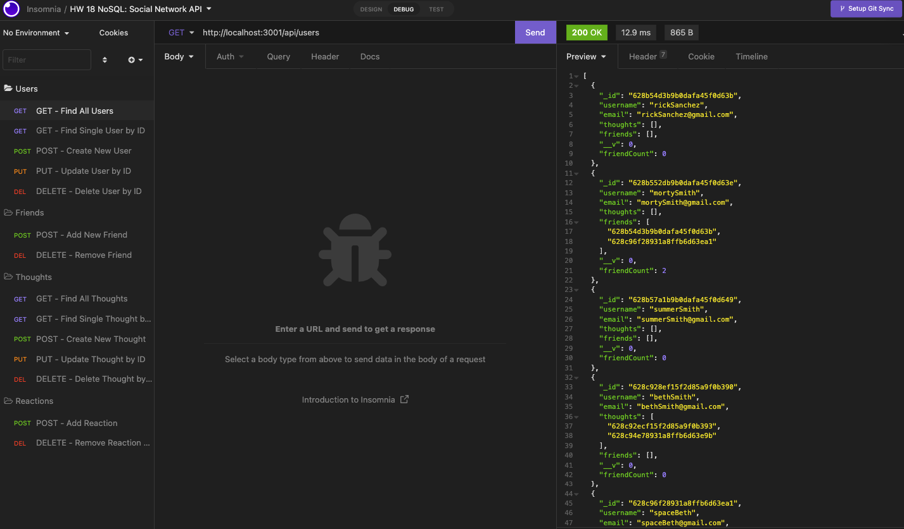
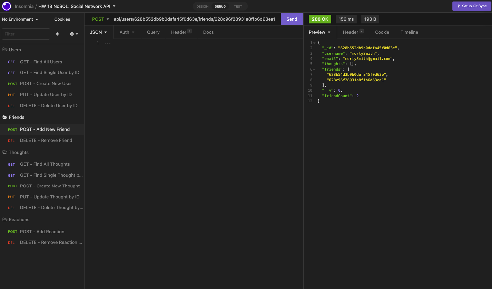
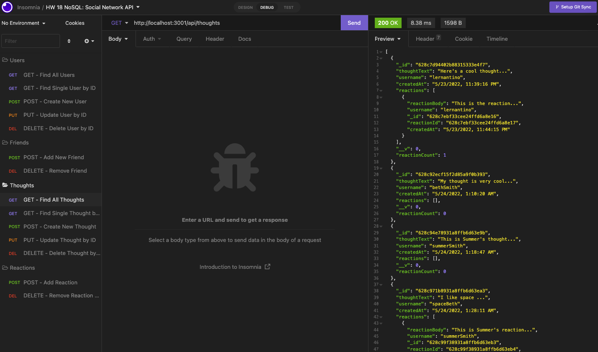
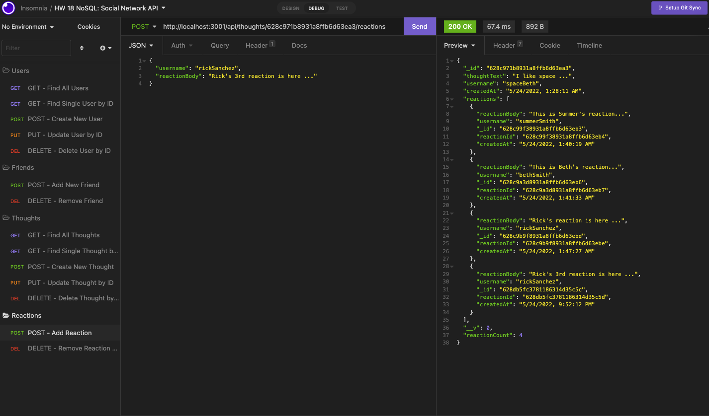

# Social Network API - NoSQL - Project


## Link

Please click [here](https://watch.screencastify.com) to find the walkthrough video that demonstrates the functionality of the Social Network API application.

## Description

The Social Network API application is a web application that users can share their thoughts, add friends, and react to friends’ thoughts. Since this is a pure back end application currently, it is recommended to use API testing tool like Insomnia to test and run all the routes. As no seed data is provided in the Repo, so feel free to create your own data using Insomnia. We can also view all the data using MongoDBCompass.

This application contains different routes for users, friends, thoughts, and reactions. Users can use the POST and DELETE routes to add or remove a friend, users also have the ability to create, update, and delete a thought by using the POST, PUT and DELETE routes. Additionally, users can add or remove reaction to a friend's thought by using the POST and DELETE routes. 

## Table of Contents

- [Link](#link)
- [Description](#description)
- [Installation](#installation)
- [Usage](#usage)
- [Technologies](#technologies)
- [Credits](#credits)
- [Assets](#assets)
- [License](#license)

## Installation

Please follow the installation instruction below to set up the environment for running this application:
- Clone the Repo for this application
- Install **MongoDB** on your local machine if you do not have one yet. Follow the [MongoDB installation guide on The Full-Stack Blog](https://coding-boot-camp.github.io/full-stack/mongodb/how-to-install-mongodb) to install MongoDB locally. 
- Open the terminal and change directory to this Repo folder
- Enter the following commands in terminal:
    - `npm init -y` - to generate the package.json and package-lock.json
        - If both files already exist, then skip this step
    - Open the *package.json* file and check the "dependencies", type in `npm i` if the following dependencies exist already: 
        - "express"
        - "mongoose"
    - If missing any of the dependencies listed above, enter the following commands to install the associated packages:
        - `npm i express` - to install Express.js
        - `npm i mongoose` - to install Mongoose
- Make sure your Repo has the *.gitignore* file which includes `node_modules`, `.env` and `.DS_Store` (for macOS) before installing any npm dependencies
- Install [Insomnia](https://insomnia.rest/download) if you do not have one yet
    - We will use the Insomnia to test our back end routes
- Install [MongoDBCompass](https://www.mongodb.com/docs/compass/current/install/) - we can use MongoDBCompass to view data in database

## Usage

Please follow the usage instruction here:
- Open this Repo in your code editor
- Open the terminal and change directory to this Repo folder
- Follow the installation instruction above to ensure Express.js and Mongoose are installed in this Repo
- Type the following commands in terminal to start/stop the application: 
    - To start the app: `npm start`
    - To stop the app: `Control+C` then close your terminal
- Open Insomnia to test all routes:
    - GET routes to find all users and all thoughts
    - GET routes to find a single user and a single thought
    - POST routes to create new user and new thought
    - PUT routes to update user and thought
    - DELETE routes to delete user and thought
    - POST routes to add new friend to user and reaction to thought
    - DELETE routes to remove friend from user and reaction from thought
- Open MongoDBCompass to view data for users and thoughts

## Technologies

```
JavaScript
Express.js
MongoDB
Mongoose
```

## Credits

The Social Network API application is functioning with [npm Express](https://www.npmjs.com/package/express) and [npm Mongoose](https://www.npmjs.com/package/mongoose)

## Assets

The following images demonstrate the Social Network API application's functionality:

Routes for users:


Routes for friends:


Routes for thoughts:


Routes for reactions:


## License

Copyright (c) 2022 Elaine Qiling Deng. This project is licensed under the terms of the [MIT license](LICENSE).